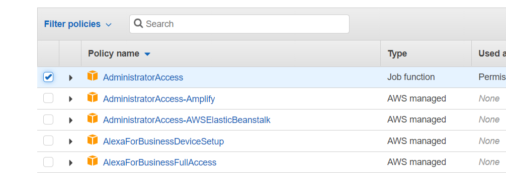
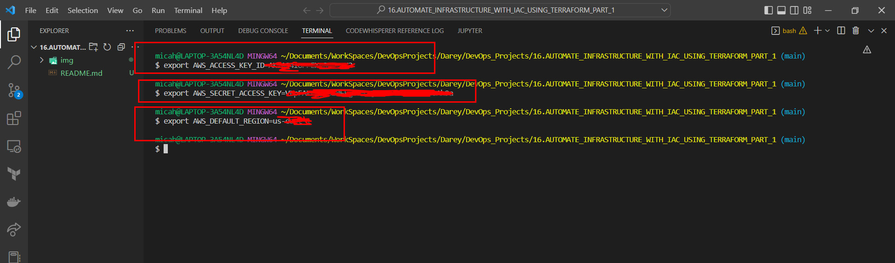
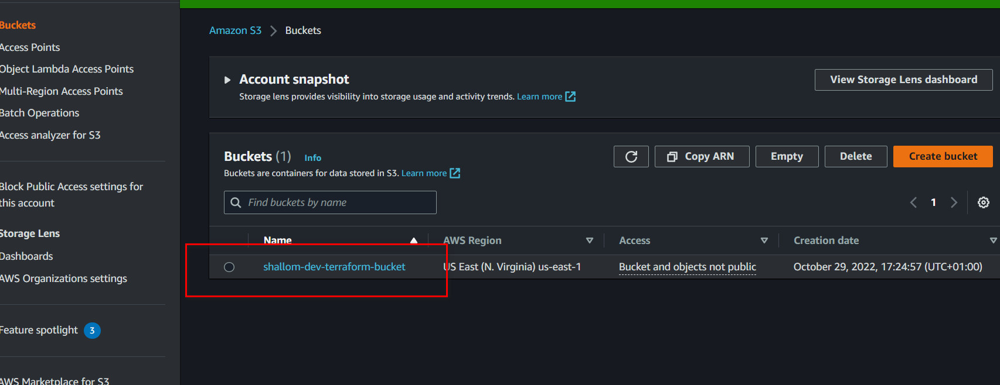
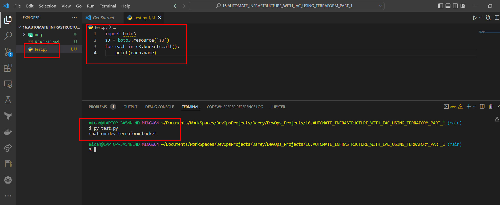
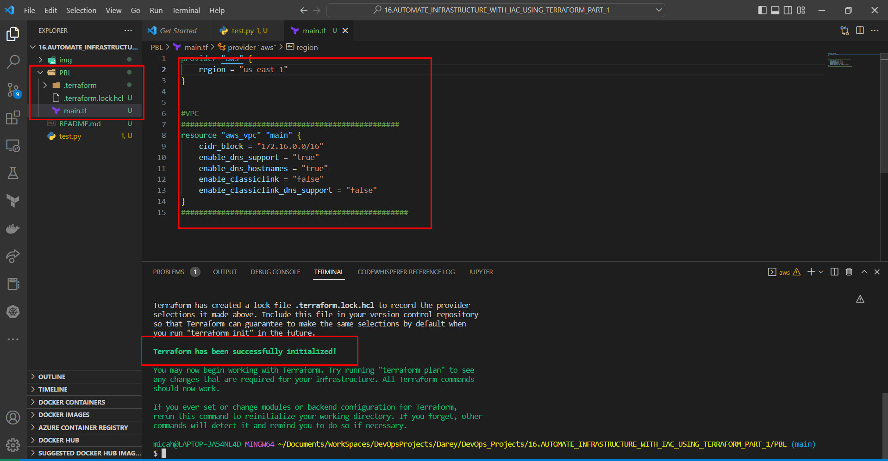
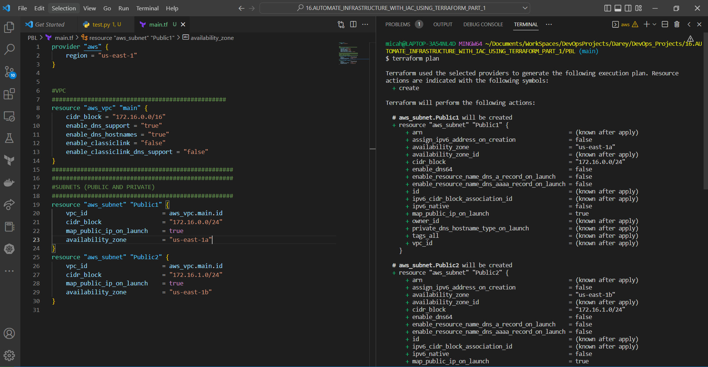
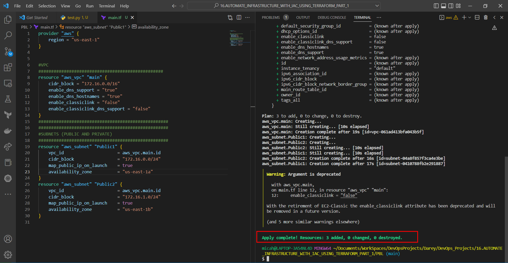
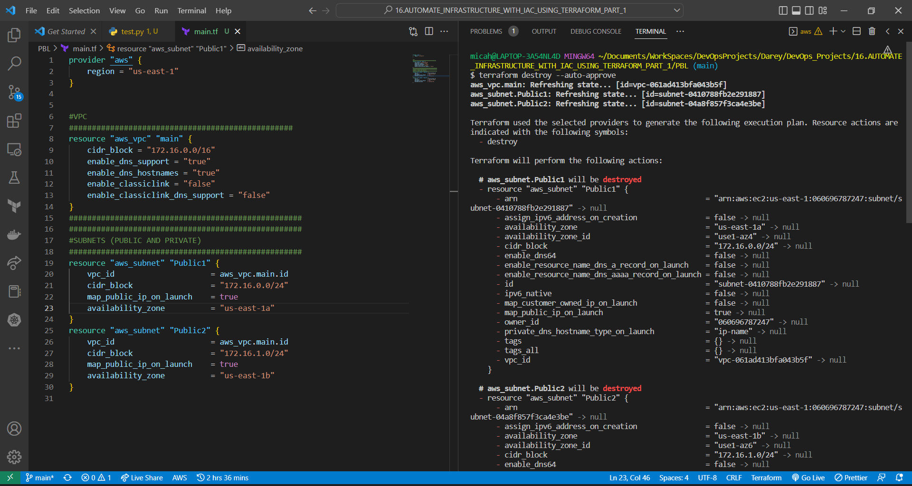

# Automating Infrastructure Creation With IAC (Terraform)
#

- Create an IAM user, name it terraform (ensure that the user has only programatic access to your AWS account) and grant this user AdministratorAccess permissions.



- Copy the secret access key and access key ID. Save them in a notepad temporarily.



- Create an S3 bucket to store Terraform state file. You can name it something like <yourname>-dev-terraform-bucket (Note: S3 bucket names must be unique within a region partition. We will use this bucket from Project-17 onwards.


- When you have configured authentication and installed `boto3`, make sure you can programmatically access your AWS account by running following commands in >python:

#

## VPC | SUBNETS | SECURITY GROUPS
#
- Let us create a directory structure
- Open your Visual Studio Code and:

- Create a folder called PBL
- Create a file in the folder, name it main.tf
#

## Provider and VPC resource section
#
- Set up Terraform CLI as per this instruction.

- Add AWS as a provider, and a resource to create a VPC in the main.tf file.
- Provider block informs Terraform that we intend to build infrastructure within AWS.
- Resource block will create a VPC.

**Note:** You can change the configuration above to create your VPC in other region that is closer to you. The same applies to all configuration snippets that will follow.

- The next thing we need to do, is to download necessary plugins for Terraform to work. These plugins are used by providers and provisioners. At this stage, we only have provider in our main.tf file. So, Terraform will just download plugin for AWS provider.



- Notice that a new directory has been created: .terraform\.... This is where Terraform keeps plugins. Generally, it is safe to delete this folder. It just means that you must execute terraform init again, to download them.
- Moving on, let us create the only resource we just defined. aws_vpc. But before we do that, we should check to see what terraform intends to create before we tell it to go ahead and create it.

- Run `terraform plan`
- Then, if you are happy with changes planned, execute `terraform apply`
  


#

## Subnets resource section
#

According to our architectural design, we require 6 subnets:

- 2 public
- 2 private for webservers
- 2 private for data layer
  
Let us create the first 2 public subnets.

Add below configuration to the main.tf file:

```
# Create public subnets1
    resource "aws_subnet" "public1" {
    vpc_id                     = aws_vpc.main.id
    cidr_block                 = "172.16.0.0/24"
    map_public_ip_on_launch    = true
    availability_zone          = "eu-central-1a"

}

# Create public subnet2
    resource "aws_subnet" "public2" {
    vpc_id                     = aws_vpc.main.id
    cidr_block                 = "172.16.1.0/24"
    map_public_ip_on_launch    = true
    availability_zone          = "eu-central-1b"
}
```

We are creating 2 subnets, therefore declaring 2 resource blocks – one for each of the subnets.
We are using the vpc_id argument to interpolate the value of the VPC id by setting it to aws_vpc.main.id. This way, Terraform knows inside which VPC to create the subnet.
Run terraform plan and terraform apply

Observations:

Hard coded values: Remember our best practice hint from the beginning? Both the availability_zone and cidr_block arguments are hard coded. We should always endeavour to make our work dynamic.
Multiple Resource Blocks: Notice that we have declared multiple resource blocks for each subnet in the code. This is bad coding practice. We need to create a single resource block that can dynamically create resources without specifying multiple blocks. 
Now let us improve our code by refactoring it.

First, destroy the current infrastructure. Since we are still in development, this is totally fine. Otherwise, DO NOT DESTROY an infrastructure that has been deployed to production.

To destroy whatever has been created run terraform destroy command, and type yes after evaluating the plan.

#
